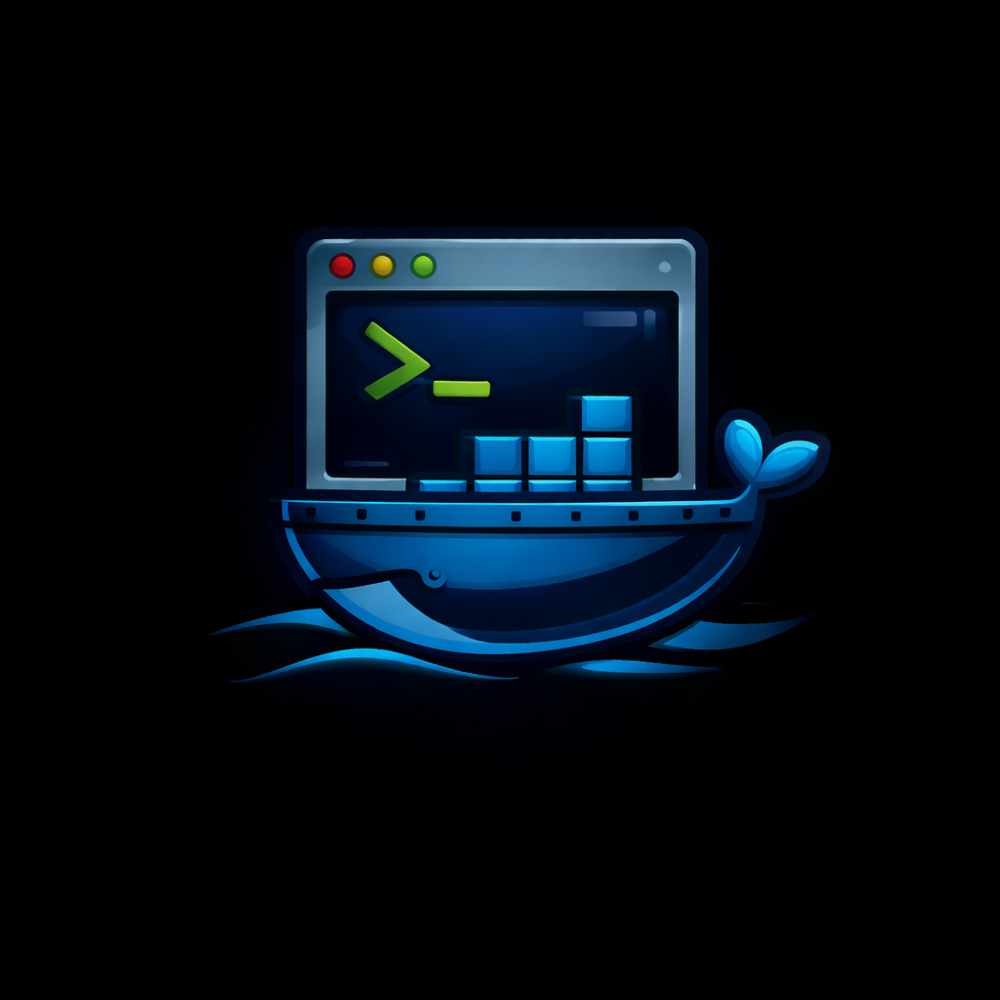
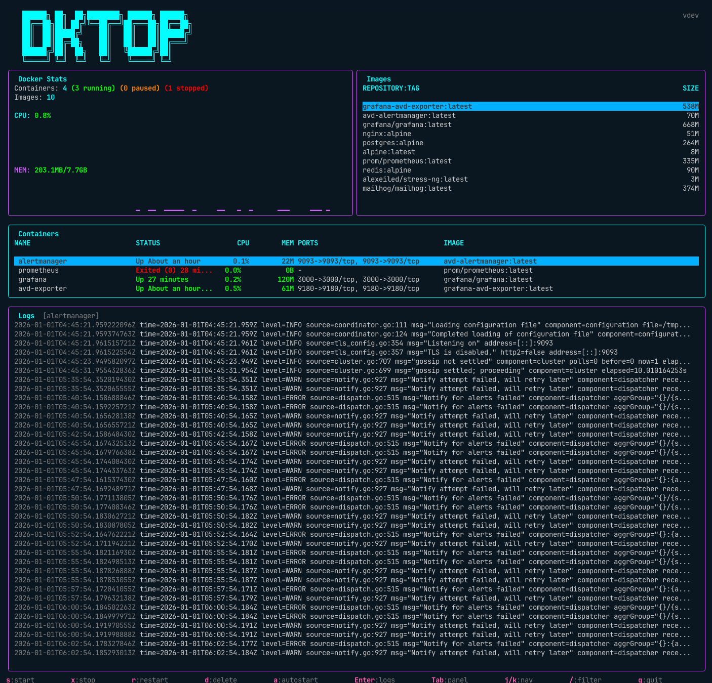

# dktop

<p align="center">
  
</p>

<p align="center">
  <strong>A Docker container manager with a btop-style terminal interface.</strong>
</p>

<p align="center">
  <a href="https://github.com/seb/dktop/releases"></a>
  <a href="https://github.com/seb/dktop/actions"></a>
  <a href="https://github.com/seb/dktop/blob/main/LICENSE"></a>
  <a href="https://goreportcard.com/report/github.com/seb/dktop"></a>
</p>

<p align="center">
  
</p>

## Features

- Real-time container monitoring with CPU/memory sparkline graphs
- Start, stop, restart, and delete containers
- View and manage Docker images (pull/delete)
- Live container logs with auto-scroll
- Autostart containers with daemon mode
- btop-inspired colorful terminal UI
- Keyboard-driven vim-style navigation
- Filter containers and images
- Cross-platform: macOS, Linux, and Windows

## Installation

### Download Binary

Download the latest release for your platform from the [Releases](https://github.com/seb/dktop/releases) page.

#### macOS

```bash
# Apple Silicon (M1/M2/M3)
curl -Lo dktop https://github.com/seb/dktop/releases/latest/download/dktop-darwin-arm64
chmod +x dktop
sudo mv dktop /usr/local/bin/

# Intel
curl -Lo dktop https://github.com/seb/dktop/releases/latest/download/dktop-darwin-amd64
chmod +x dktop
sudo mv dktop /usr/local/bin/
```

#### Linux

```bash
# x86_64
curl -Lo dktop https://github.com/seb/dktop/releases/latest/download/dktop-linux-amd64
chmod +x dktop
sudo mv dktop /usr/local/bin/

# ARM64
curl -Lo dktop https://github.com/seb/dktop/releases/latest/download/dktop-linux-arm64
chmod +x dktop
sudo mv dktop /usr/local/bin/
```

#### Windows

Download `dktop-windows-amd64.exe` from the [Releases](https://github.com/seb/dktop/releases) page and add it to your PATH.

Or using PowerShell:

```powershell
Invoke-WebRequest -Uri "https://github.com/seb/dktop/releases/latest/download/dktop-windows-amd64.exe" -OutFile "dktop.exe"
```

### Go Install

```bash
go install github.com/seb/dktop/cmd/dktop@latest
```

### Build from Source

```bash
git clone https://github.com/seb/dktop.git
cd dktop
go build -o dktop ./cmd/dktop
```

## Usage

```bash
# Start the interactive TUI
dktop

# Run as daemon (monitors autostart containers)
dktop daemon

# Show version
dktop version

# Show help
dktop help
```

## Keybindings

### Global

| Key | Action |
|-----|--------|
| `Tab` | Switch between panels |
| `j/k` or `↑/↓` | Navigate lists |
| `/` | Filter containers/images |
| `Esc` | Cancel / Go back |
| `q` | Quit |

### Containers Panel

| Key | Action |
|-----|--------|
| `s` | Start container |
| `x` | Stop container |
| `r` | Restart container |
| `d` | Delete container |
| `a` | Toggle autostart |
| `Enter` | View container logs |

### Images Panel

| Key | Action |
|-----|--------|
| `p` | Pull new image |
| `d` | Delete image |

### Logs Panel

| Key | Action |
|-----|--------|
| `j/k` | Scroll up/down |
| `G` | Scroll to bottom |
| `Esc` | Back to containers |

## Layout

```ini
    ██████╗ ██╗  ██╗████████╗ ██████╗ ██████╗
    ██╔══██╗██║ ██╔╝╚══██╔══╝██╔═══██╗██╔══██╗                              v1.0.0
    ██║  ██║█████╔╝    ██║   ██║   ██║██████╔╝
    ██║  ██║██╔═██╗    ██║   ██║   ██║██╔═══╝
    ██████╔╝██║  ██╗   ██║   ╚██████╔╝██║
    ╚═════╝ ╚═╝  ╚═╝   ╚═╝    ╚═════╝ ╚═╝
╭─ Docker Stats ─────────────────────────────╮╭─ Images ─────────────────────────╮
│ Containers: 5 (3 running) (0 paused) (2 stopped)│ REPOSITORY:TAG          SIZE │
│ Images: 12                                 ││ nginx:alpine           43.2M     │
│                                            ││ redis:alpine           32.1M     │
│ CPU: 38.2%   ▁▂▃▄▅▆▇█▇▆▅▄▃▂▁▂▃▄▅           ││ postgres:alpine       241.2M     │
│ MEM: 2.1G/8.0G   ▄▄▄▅▅▅▅▄▄▄▄▄▄▄▄▄          ││                                  │
╰────────────────────────────────────────────╯╰──────────────────────────────────╯
╭─ Containers ───────────────────────────────────────────────────────────────────╮
│ NAME              STATUS        CPU     MEM     PORTS             IMAGE        │
│ █nginx           Up 2 days    12.3%   256M    80->8080/tcp      nginx          │
│  postgres        Up 2 days    2.1%    512M    5432/tcp          postgres       │
│  redis           Up 2 days    0.5%    32M     6379/tcp          redis          │
╰────────────────────────────────────────────────────────────────────────────────╯
╭─ Logs [nginx] ─────────────────────────────────────────────────────────────────╮
│ 2024-01-15T10:23:45 192.168.1.1 - - "GET / HTTP/1.1" 200                       │
│ 2024-01-15T10:23:46 192.168.1.1 - - "GET /api HTTP/1.1" 200                    │
╰────────────────────────────────────────────────────────────────────────────────╯
 s:start  x:stop  r:restart  d:delete  a:autostart  Tab:panel  j/k:nav  q:quit
```

## Configuration

Config file location:

- **macOS/Linux:** `~/.config/dktop/config.yaml`
- **Windows:** `%APPDATA%\dktop\config.yaml`

```yaml
# Refresh rate in milliseconds
refresh_rate: 1000

# Default view (containers or images)
default_view: containers

# Number of log lines to display
log_lines: 100

# Containers to autostart when running daemon mode
autostart_list:
  - my-container
  - web-server
```

## Daemon Mode

The daemon mode monitors your autostart containers and ensures they stay running:

```bash
dktop daemon
```

When a container in the autostart list stops, the daemon will automatically restart it.

You can toggle autostart for individual containers in the TUI using the `a` key, which:

1. Adds/removes the container from the config's autostart list
2. Sets the Docker restart policy to `always` or `no`

## Requirements

- Docker daemon running and accessible
   - **macOS:** Docker Desktop
   - **Linux:** Docker Engine or Docker Desktop
   - **Windows:** Docker Desktop with WSL 2

## Building

```bash
# Build for current platform
go build -o dktop ./cmd/dktop

# Build with version info
go build -ldflags "-X github.com/seb/dktop/internal/version.Version=1.0.0" -o dktop ./cmd/dktop

# Run tests
go test ./...
```

## Contributing

Contributions are welcome! Please feel free to submit a Pull Request.

1. Fork the repository
2. Create your feature branch (`git checkout -b feature/amazing-feature`)
3. Commit your changes (`git commit -m 'Add some amazing feature'`)
4. Push to the branch (`git push origin feature/amazing-feature`)
5. Open a Pull Request

## License

MIT License - see [LICENSE](LICENSE) for details.

## Acknowledgments

- [Bubble Tea](https://github.com/charmbracelet/bubbletea) - TUI framework
- [Lip Gloss](https://github.com/charmbracelet/lipgloss) - Styling
- [Docker SDK for Go](https://github.com/docker/docker) - Docker API client
- Inspired by [btop](https://github.com/aristocratos/btop)
